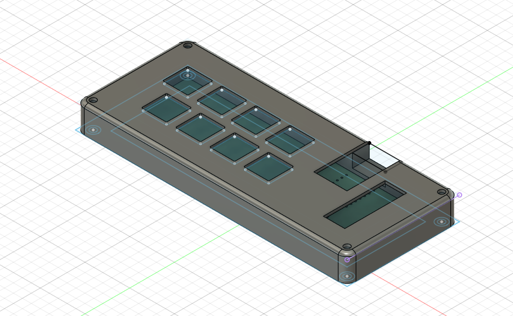
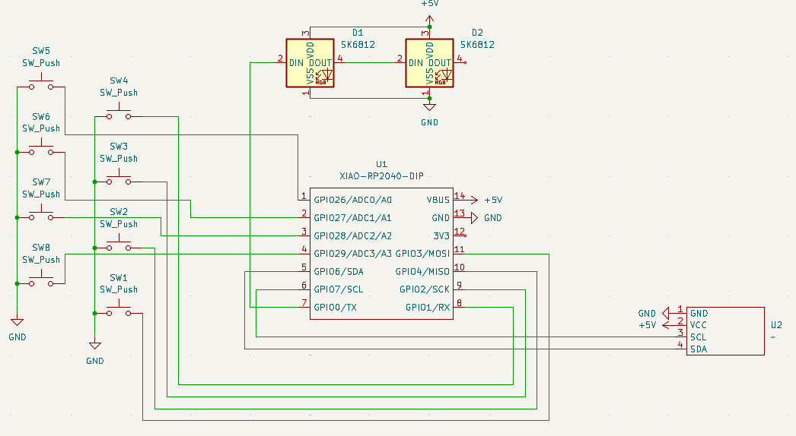
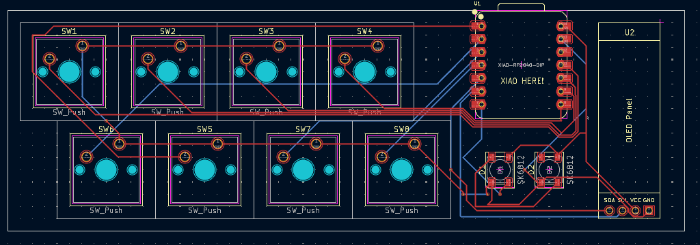
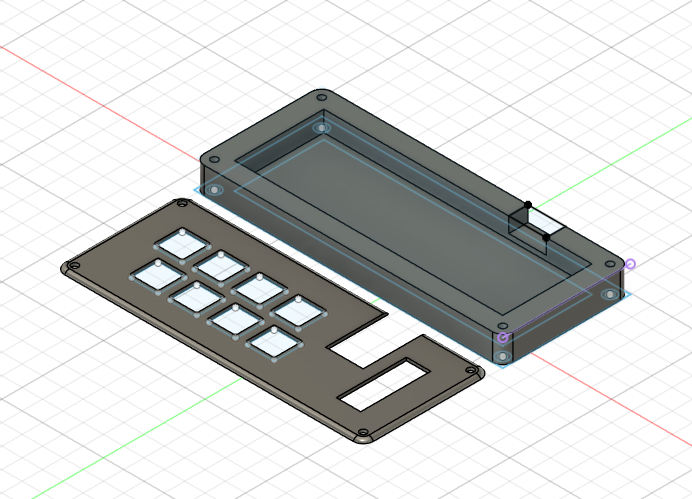

Overall hackpad

Schematics

PCB

Case

BOM:
- 8x Cherry MX swicthes
- 2x SK6812 MINI Leds
- 1x XIAO RP2040
- 8x Blank DSA Keycaps
- 4x M3x16 Bolt
- 4x M3 Heatset
- 1x SSD1306-0.91-OLED-4pin-128x32

